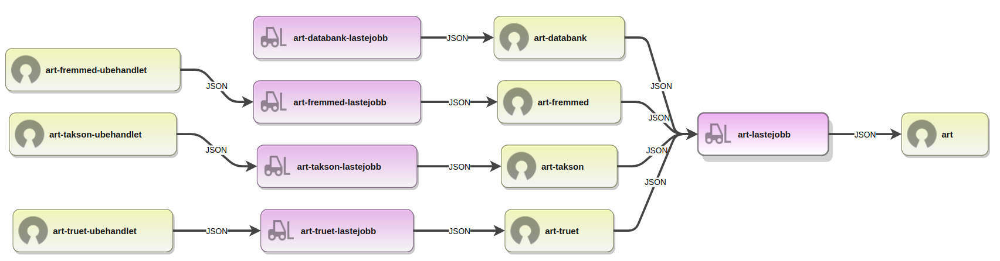

# art-fremmed-lastejobb

Lastejobb for vurderinger av fremmede arter

## Dokumentasjon

- https://www.artsdatabanken.no/Files/17654/Retningslinjer_for__kologisk_risikovurdering_av_fremmede_arter_-_versjon_3.5.pdf

## Komponenter og dataflyt

### Dataflyt

[](https://artsdatabanken.github.io/art-lastejobb/)

### Tegnforklaring

| Symbol                                                                                                   | Forklaring               |
| -------------------------------------------------------------------------------------------------------- | ------------------------ |
|   | API (HTTP REST)          |
|  | Åpne data                |
|  | Kart                     |
|  | Lastejobb / Konvertering |
|   | Bibliotek                |
|  | Verktøy                  |
|   | Web-side/applikasjon     |

## Kataloger

- `stages/download`: Script for å laste ned eksterne datafiler til `temp/`
- `stages/transform`: Script som produserer resultatet og legger det i `build/`
- `build`: Filene som kommer ut av lastejobben
- `data`: Temporær lagring av nedlastede data og mellomformater

## Bruk

### Installere

```bash
npm run install
```

Laster ned avhengige biblioteker til `node_modules`.

### Download

```bash
npm run download
```

Laster ned eksterne avhengigheter som lastejobben er avhengig av for å produsere sitt resultat i "transform". Denne kjører stegene som ligger i `stages/download`. Nedlastede data lagres som en konvensjon i katalog `data`.

### Transform

```bash
npm run transform
```

Bruker allerede nedlastede data til å produsere sitt resultat. Denne brukes gjerne mens man utvikler så man slipper å laste ned data hver gang, og kan også brukes uten at man har tilgang til nett sålenge man har gjort `download` først. Denne kjører stegene som ligger i `stages/transform`

Sluttproduktet av transform skrives som en konvensjon til katalogen `build`.

### Build

```bash
npm run build
```

Kjører hele lastejobben, først `download`, så `transform`.

### Deploy

```bash
npm run deploy
```

Tar filene fra `build`-katalogen som er produsert i `build` eller `transform` og publiserer disse offentlig slik at andre lastejobber eller konsumenter kan nå dem uten å kjøre lastejobben.
